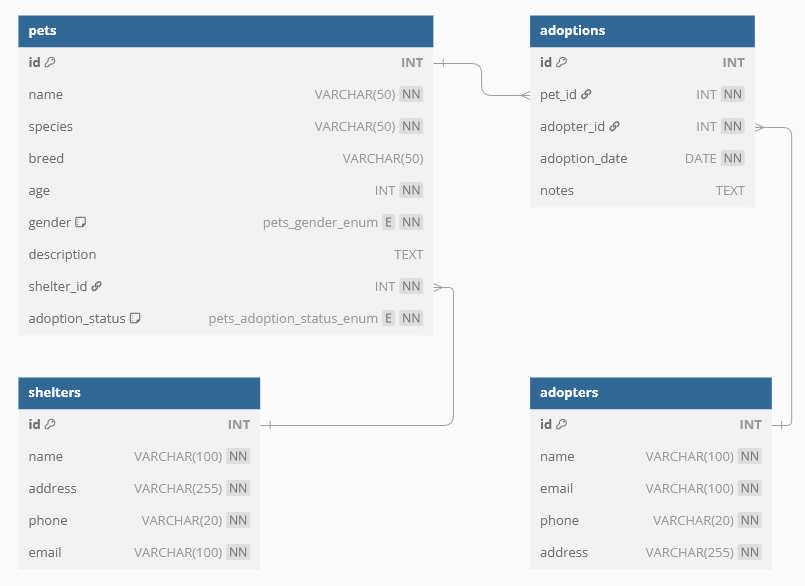
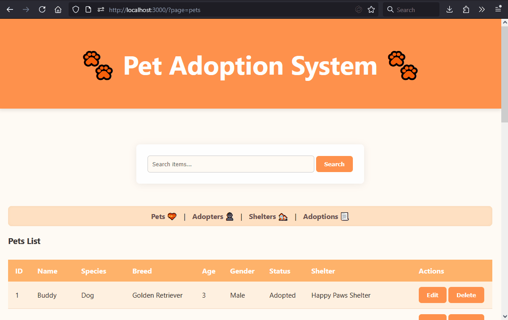
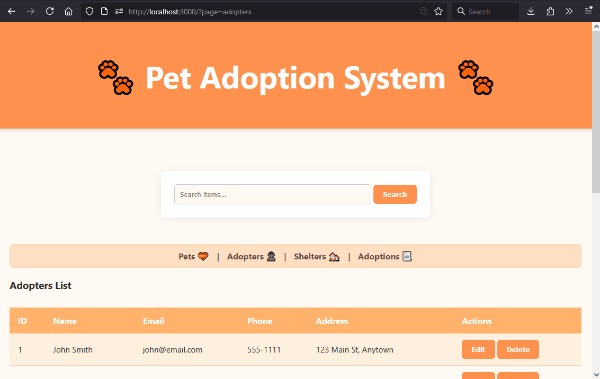
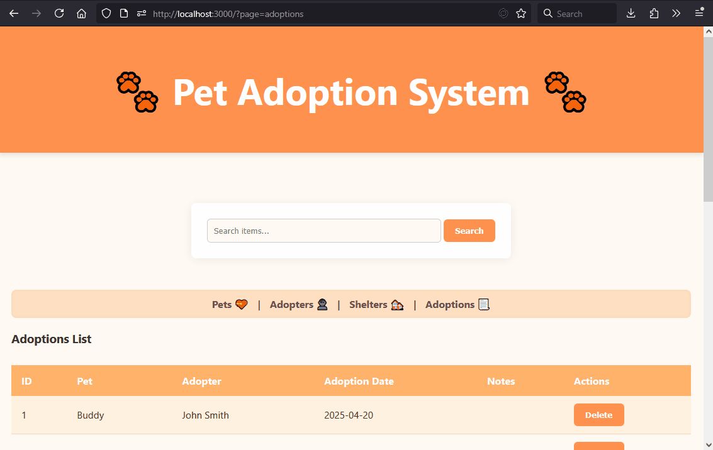

# Janji
Saya Zakiyah Hasanah dengan NIM 2305274 mengerjakan Tugas Praktikum 7 dalam mata kuliah Desain dan Pemrograman Berorientasi Objek untuk keberkahanNya maka saya tidak melakukan kecurangan seperti yang telah dispesifikasikan.

# Desain Program


Program ini memiliki fungsionalitas DBMS pada database SQL `database/pet_adoption_db.sql` yang di dalamnya terdapat 4 tabel:
1. `pets`: informasi tentang hewan peliharaan.
2. `shelters`: informasi tentang tempat penampungan.
3. `adopters`: data calon pengadopsi.
4. `adoptions`: catatan proses adopsi hewan.

Penjelasan relasi antar-tabel:
- Tabel `pets` memiliki `shelter_id` sebagai foreign key yang merujuk ke `shelters(id)`.
- Tabel `adoptions` menggunakan `pet_id` dan `adopter_id` sebagai foreign key yang masing-masing merujuk ke `pets(id)` dan `adopters(id)`.

Relasi yang terbentuk -- satu penampungan memiliki banyak hewan, satu calon pengadopsi bisa mengadopsi lebih dari satu hewan, dan satu hewan hanya bisa diadopsi oleh satu pengadopsi.

Beberapa field seperti `breed` dan `notes` boleh diisi `NULL`. Untuk `gender` pada `pets`, value-nya menggunakan tipe `ENUM` karena hanya bisa berisi `"Male"` atau `"Female"`.

> **Catatan:**  
> Proyek ini tidak menggunakan fitur *cascading delete*. Artinya, jika user mencoba menghapus data yang menjadi referensi oleh foreign key dari tabel lain (misalnya menghapus pet yang sudah diadopsi), maka akan terjadi error SQL.

Pada project ini, terdapat satu view untuk setiap tabel yang menampilkan data, dengan default view tabel `pets`.  Operasi **CRUD** dapat dilakukan pada tabel `pets`, `shelters`, dan `adopters`.  Namun, pada `adoptions` hanya operasi **Create**, **Read**, dan **Delete** yang dapat dilakukan.  Pada `index.php`, ini dilakukan dengan menggunakan `$_POST['action']` dan `header("Location: ?page=view_sekarang");`.

Baris kode `header("Location: ?page=view_sekarang")` dst digunakan untuk melakukan *redirect* ke halaman lain.  Redirect ini dilakukan ke file yang sama (`index.php`) tetapi dengan parameter `page=view_sekarang`. Tanpa penggunaan ini, jika user mengakses `index.php` tanpa menyertakan parameter `page`, maka dapat terjadi error atau fallback behavior.

Halaman views di-*include* dari `index.php` dan ditampilkan sesuai dengan tab yang sedang aktif menggunakan `$_GET['page']`. Adapun text field untuk melakukan searching, jika diisi dan ditekan enter / tombol search, ia akan mencari item pada tabel yang sekarang halamannya sedang dibuka. Pada `index.php` juga di-*require* `header.php` dan `footer.php` untuk "membungkus" bagian atas dan bawah halaman secara konsisten, agar tampilan UI seragam dan navigasi tetap tersedia di setiap halaman dan kode lebih fleksibel sehingga perubahan dapat dilakukan dengan mudah.

### Penjelasan `$_GET` dan `$_POST`
- `$_GET` digunakan untuk mengambil data dari URL. Misalnya, `index.php?page=shelters` akan menyimpan string `"shelters"` pada `$_GET['page']`. Data yang dikirim melalui GET terlihat di URL dan cocok untuk navigasi antar halaman.

- `$_POST` digunakan untuk mengirim data melalui formulir HTML secara tersembunyi (tidak terlihat di URL). Pada proyek ini, `$_POST['action']` digunakan untuk menentukan tindakan apa yang dilakukan (create, update, delete). Data ini diproses di server saat form disubmit.

Adapun class `Database` pada `db.php`, ini digunakan pada class `Adopter`, `Adoption`, `Pet`, dan `Shelter`, untuk mengeksekusi query SQL secara langsung.

# Penjelasan Alur
1. Pada awalnya, file `pet_adoption_db.sql` diimpor terlebih dahulu ke database lokal. Ini dapat dilakukan dengan menjalankan perintah di command line:  
   ```
   mysql -u my_username -p pet_adoption_db < /path/to/db/file
   ```

2. Nyalakan SQL Server dan jalankan PHP server (bisa dilakukan melalui `htdocs` XAMPP, di-*setup* di Laragon, atau menggunakan ekstensi VSCode PHP Server).

3. User membuka `index.php` sesuai dengan tools yang digunakan.  
   (Misal: `localhost/nama_folder` jika menggunakan `htdocs` di XAMPP).  
   Dari halaman ini, user dapat menuju ke halaman lain yang menampilkan berbagai tabel seperti `pets`, `shelters`, `adopters`, dan `adoptions`.

4. Pada semua tampilan/view, user dapat melakukan CRUD:
    - menambahkan data baru dengan mengisi form di bawah dan menekan tombol "Create ...".
    - Pada item dari semua tabel, user dapat menghapus item tersebut dengan mengklik "Delete". Ini akan memunculkan popup konfirmasi penghapusan.
   - Pada item dari semua tabel **kecuali tabel `adoptions`**, user dapat mengedit data item tersebut dengan mengklik "Edit".

7. User juga dapat melakukan *searching* terhadap tabel yang sedang ditampilkan:  
   - `pets`: dicari berdasarkan `name`, `species`, atau `breed`.
   - `shelters`: dicari berdasarkan `name`, `address`, atau `email`.
   - `adopters`: dicari berdasarkan `name`, `email`, atau `phone`.
   - `adoptions`: dicari berdasarkan `pet name` atau `adopter name`.


# Dokumentasi
pets view: 



adopters view:



shelters view:


adoptions view:


